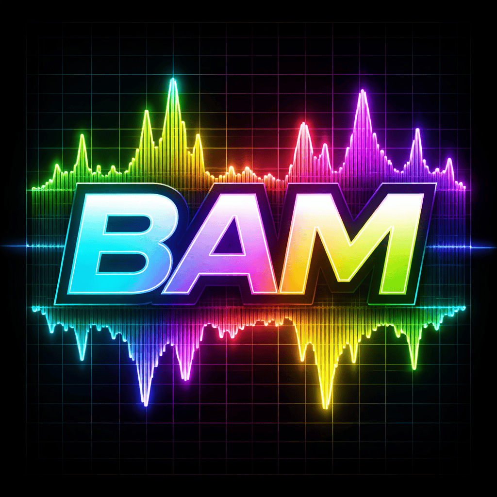
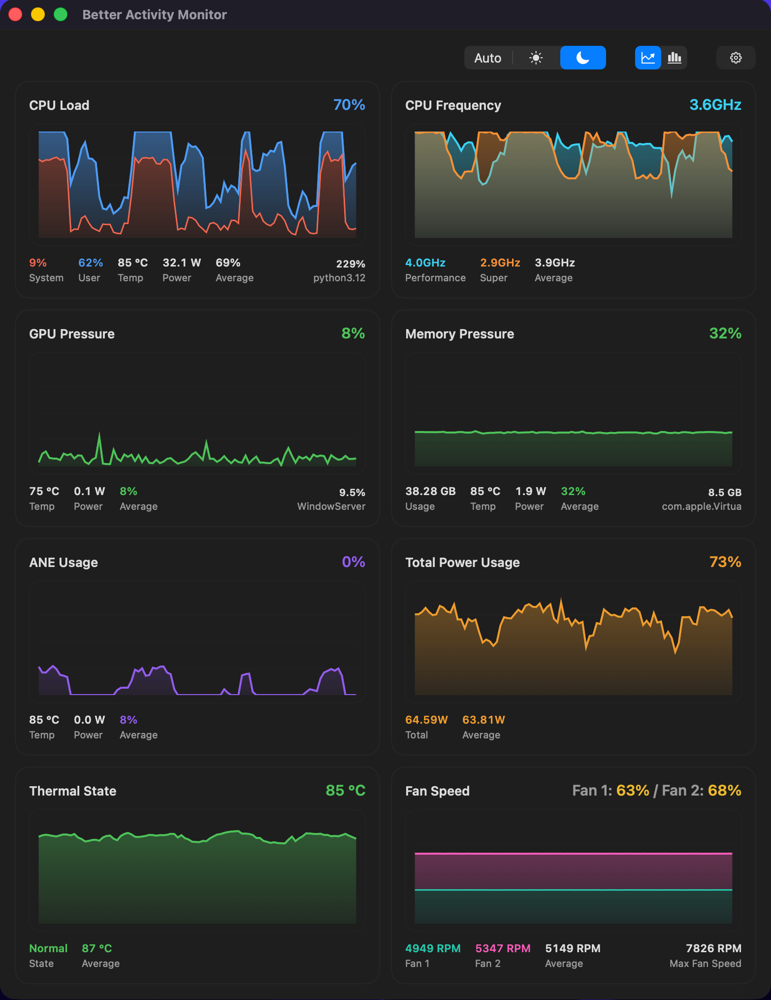

<p align="center">
  
</p>

<h1 align="center">Better Activity Monitor</h1>

Inspired by [mactop](https://github.com/metaspartan/mactop) and macOS's built in Activity Monitor, Better Activity Monitor is a polished macOS performance dashboard built for people who want faster insight than the default system tools usually provide.

It brings your Mac's most important live metrics into a single focused view, making it easier to spot load spikes, thermal pressure, power draw, and the processes driving them.

<p align="center">
  
</p>

## Why It Stands Out

- Real-time system visibility in a clean dashboard layout
- CPU load and CPU frequency tracking over time
- Memory pressure, GPU pressure, and ANE usage monitoring
- Thermal state, temperatures, fan speed, and total power usage
- Top CPU, memory, and GPU process leaders surfaced directly in the UI
- Customizable panel layout, graph styling, and appearance mode

## Built For

- Developers who want a faster at-a-glance performance view
- Power users tuning workloads on Apple silicon Macs (ARM64) only
- Anyone trying to understand heat, fan behavior, or resource spikes without digging through multiple utilities

## Requirements

- macOS 14 or later
- Swift 6 toolchain
- Xcode Command Line Tools

## Build The App Bundle

From the project root, run:

```bash
./scripts/build_app_bundle.sh
```

The script will:

- build a release executable
- generate an `.icns` file from `bam-logo.png`
- create a proper macOS `.app` bundle
- copy in the bundled `Info.plist`
- apply an ad-hoc code signature for local use

The packaged app is created at:

```text
Build/Better Activity Monitor.app
```

## Run The App

After building, you can:

- double-click `Build/Better Activity Monitor.app`
- or drag it into `/Applications`

## Rebuild After Changes

Any time you update the code, rebuild with:

```bash
./scripts/build_app_bundle.sh
```

The app bundle is recreated in the `Build/` folder each time.

## Notes

- This setup is intended for local or personal use on your own Mac.
- The app is ad-hoc signed, which is appropriate for local distribution and testing.
- It is not currently configured for App Store distribution.
- This app is completely vibe-coded, please be aware there may be mistakes.

Comments? Suggestions? Feature requests? Let me know! bam@0x6a9d.com

## Support

If you'd like to support development, you can do it here:

<a href='https://ko-fi.com/Y8Y11XJV8O' target='_blank'></a>

## License

This project is licensed under the Apache License, Version 2.0.

See [LICENSE](LICENSE) for the full license text.
